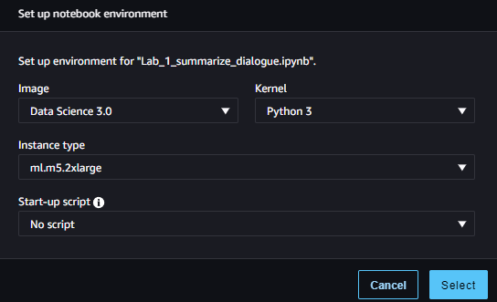

# Generative AI Use Case: Summarize Dialogue

Welcome to the practical side of this course. In this lab you will do the dialogue summarization task using generative AI. You will explore how the input text affects the output of the model, and perform prompt engineering to direct it towards the task you need. By comparing zero shot, one shot, and few shot inferences, you will take the first step towards prompt engineering and see how it can enhance the generative output of Large Language Models.

# Table of Contents

- [ 1 - Set up Kernel and Required Dependencies](#1)
- [ 2 - Summarize Dialogue without Prompt Engineering](#2)
- [ 3 - Summarize Dialogue with an Instruction Prompt](#3)
  - [ 3.1 - Zero Shot Inference with an Instruction Prompt](#3.1)
  - [ 3.2 - Zero Shot Inference with the Prompt Template from FLAN-T5](#3.2)
- [ 4 - Summarize Dialogue with One Shot and Few Shot Inference](#4)
  - [ 4.1 - One Shot Inference](#4.1)
  - [ 4.2 - Few Shot Inference](#4.2)
- [ 5 - Generative Configuration Parameters for Inference](#5)


<a name='1'></a>
## 1 - Set up Kernel and Required Dependencies

First, check that the correct kernel is chosen.


You can click on that (top right of the screen) to see and check the details of the image, kernel, and instance type.




```python
import os

instance_type_expected = 'ml-m5-2xlarge'
instance_type_current = os.environ.get('HOSTNAME')

print(f'Expected instance type: instance-datascience-{instance_type_expected}')
print(f'Currently chosen instance type: {instance_type_current}')

assert instance_type_expected in instance_type_current, f'ERROR. You selected the {instance_type_current} instance type. Please select {instance_type_expected} instead as shown on the screenshot above'
print("Instance type has been chosen correctly.")
```

    Expected instance type: instance-datascience-ml-m5-2xlarge
    Currently chosen instance type: instance-datascience-ml-m5-2xlarge
    Instance type has been chosen correctly.


Now install the required packages to use PyTorch and Hugging Face transformers and datasets.


```python
%pip install -U datasets==2.17.0

%pip install --upgrade pip
%pip install --disable-pip-version-check \
    torch==1.13.1 \
    torchdata==0.5.1 --quiet

%pip install \
    transformers==4.27.2 --quiet
```

    Collecting datasets==2.17.0
      Downloading datasets-2.17.0-py3-none-any.whl.metadata (20 kB)
    Requirement already satisfied: filelock in /opt/conda/lib/python3.10/site-packages (from datasets==2.17.0) (3.13.4)
    Requirement already satisfied: numpy>=1.17 in /opt/conda/lib/python3.10/site-packages (from datasets==2.17.0) (1.26.4)
    Requirement already satisfied: pyarrow>=12.0.0 in /opt/conda/lib/python3.10/site-packages (from datasets==2.17.0) (15.0.2)
    Requirement already satisfied: pyarrow-hotfix in /opt/conda/lib/python3.10/site-packages (from datasets==2.17.0) (0.6)
    Requirement already satisfied: dill<0.3.9,>=0.3.0 in /opt/conda/lib/python3.10/site-packages (from datasets==2.17.0) (0.3.8)
    Requirement already satisfied: pandas in /opt/conda/lib/python3.10/site-packages (from datasets==2.17.0) (2.2.2)
    Requirement already satisfied: requests>=2.19.0 in /opt/conda/lib/python3.10/site-packages (from datasets==2.17.0) (2.31.0)
    Requirement already satisfied: tqdm>=4.62.1 in /opt/conda/lib/python3.10/site-packages (from datasets==2.17.0) (4.66.1)
    Collecting xxhash (from datasets==2.17.0)
      Downloading xxhash-3.5.0-cp310-cp310-manylinux_2_17_x86_64.manylinux2014_x86_64.whl.metadata (12 kB)
    Requirement already satisfied: multiprocess in /opt/conda/lib/python3.10/site-packages (from datasets==2.17.0) (0.70.16)
    Collecting fsspec<=2023.10.0,>=2023.1.0 (from fsspec[http]<=2023.10.0,>=2023.1.0->datasets==2.17.0)
      Downloading fsspec-2023.10.0-py3-none-any.whl.metadata (6.8 kB)
    Collecting aiohttp (from datasets==2.17.0)
      Downloading aiohttp-3.10.5-cp310-cp310-manylinux_2_17_x86_64.manylinux2014_x86_64.whl.metadata (7.5 kB)
    Collecting huggingface-hub>=0.19.4 (from datasets==2.17.0)
      Downloading huggingface_hub-0.24.6-py3-none-any.whl.metadata (13 kB)
    Requirement already satisfied: packaging in /opt/conda/lib/python3.10/site-packages (from datasets==2.17.0) (23.2)
    Requirement already satisfied: pyyaml>=5.1 in /opt/conda/lib/python3.10/site-packages (from datasets==2.17.0) (6.0.1)
    Collecting aiohappyeyeballs>=2.3.0 (from aiohttp->datasets==2.17.0)
      Downloading aiohappyeyeballs-2.4.0-py3-none-any.whl.metadata (5.9 kB)
    Collecting aiosignal>=1.1.2 (from aiohttp->datasets==2.17.0)
      Downloading aiosignal-1.3.1-py3-none-any.whl.metadata (4.0 kB)
    Requirement already satisfied: attrs>=17.3.0 in /opt/conda/lib/python3.10/site-packages (from aiohttp->datasets==2.17.0) (23.2.0)
    Collecting frozenlist>=1.1.1 (from aiohttp->datasets==2.17.0)
      Downloading frozenlist-1.4.1-cp310-cp310-manylinux_2_5_x86_64.manylinux1_x86_64.manylinux_2_17_x86_64.manylinux2014_x86_64.whl.metadata (12 kB)
    Collecting multidict<7.0,>=4.5 (from aiohttp->datasets==2.17.0)
      Downloading multidict-6.0.5-cp310-cp310-manylinux_2_17_x86_64.manylinux2014_x86_64.whl.metadata (4.2 kB)
    Collecting yarl<2.0,>=1.0 (from aiohttp->datasets==2.17.0)
      Downloading yarl-1.9.4-cp310-cp310-manylinux_2_17_x86_64.manylinux2014_x86_64.whl.metadata (31 kB)
    Collecting async-timeout<5.0,>=4.0 (from aiohttp->datasets==2.17.0)
      Downloading async_timeout-4.0.3-py3-none-any.whl.metadata (4.2 kB)
    Requirement already satisfied: typing-extensions>=3.7.4.3 in /opt/conda/lib/python3.10/site-packages (from huggingface-hub>=0.19.4->datasets==2.17.0) (4.11.0)
    Requirement already satisfied: charset-normalizer<4,>=2 in /opt/conda/lib/python3.10/site-packages (from requests>=2.19.0->datasets==2.17.0) (3.3.2)
    Requirement already satisfied: idna<4,>=2.5 in /opt/conda/lib/python3.10/site-packages (from requests>=2.19.0->datasets==2.17.0) (3.6)
    Requirement already satisfied: urllib3<3,>=1.21.1 in /opt/conda/lib/python3.10/site-packages (from requests>=2.19.0->datasets==2.17.0) (2.2.1)
    Requirement already satisfied: certifi>=2017.4.17 in /opt/conda/lib/python3.10/site-packages (from requests>=2.19.0->datasets==2.17.0) (2024.2.2)
    Requirement already satisfied: python-dateutil>=2.8.2 in /opt/conda/lib/python3.10/site-packages (from pandas->datasets==2.17.0) (2.9.0)
    Requirement already satisfied: pytz>=2020.1 in /opt/conda/lib/python3.10/site-packages (from pandas->datasets==2.17.0) (2024.1)
    Requirement already satisfied: tzdata>=2022.7 in /opt/conda/lib/python3.10/site-packages (from pandas->datasets==2.17.0) (2024.1)
    Requirement already satisfied: six>=1.5 in /opt/conda/lib/python3.10/site-packages (from python-dateutil>=2.8.2->pandas->datasets==2.17.0) (1.16.0)
    Downloading datasets-2.17.0-py3-none-any.whl (536 kB)
       ━━━━━━━━━━━━━━━━━━━━━━━━━━━━━━━━━━━━━━━━ 536.6/536.6 kB 6.2 MB/s eta 0:00:00:00:01
    [?25hDownloading fsspec-2023.10.0-py3-none-any.whl (166 kB)
       ━━━━━━━━━━━━━━━━━━━━━━━━━━━━━━━━━━━━━━━━ 166.4/166.4 kB 2.4 MB/s eta 0:00:00:00:01
    [?25hDownloading aiohttp-3.10.5-cp310-cp310-manylinux_2_17_x86_64.manylinux2014_x86_64.whl (1.2 MB)
       ━━━━━━━━━━━━━━━━━━━━━━━━━━━━━━━━━━━━━━━━ 1.2/1.2 MB 15.4 MB/s eta 0:00:00:00:01
    [?25hDownloading huggingface_hub-0.24.6-py3-none-any.whl (417 kB)
       ━━━━━━━━━━━━━━━━━━━━━━━━━━━━━━━━━━━━━━━━ 417.5/417.5 kB 5.6 MB/s eta 0:00:00:00:01
    [?25hDownloading xxhash-3.5.0-cp310-cp310-manylinux_2_17_x86_64.manylinux2014_x86_64.whl (194 kB)
       ━━━━━━━━━━━━━━━━━━━━━━━━━━━━━━━━━━━━━━━━ 194.1/194.1 kB 3.5 MB/s eta 0:00:00ta 0:00:01
    [?25hDownloading aiohappyeyeballs-2.4.0-py3-none-any.whl (12 kB)
    Downloading aiosignal-1.3.1-py3-none-any.whl (7.6 kB)
    Downloading async_timeout-4.0.3-py3-none-any.whl (5.7 kB)
    Downloading frozenlist-1.4.1-cp310-cp310-manylinux_2_5_x86_64.manylinux1_x86_64.manylinux_2_17_x86_64.manylinux2014_x86_64.whl (239 kB)
       ━━━━━━━━━━━━━━━━━━━━━━━━━━━━━━━━━━━━━━━━ 239.5/239.5 kB 3.6 MB/s eta 0:00:00:00:01
    [?25hDownloading multidict-6.0.5-cp310-cp310-manylinux_2_17_x86_64.manylinux2014_x86_64.whl (124 kB)
       ━━━━━━━━━━━━━━━━━━━━━━━━━━━━━━━━━━━━━━━━ 124.3/124.3 kB 1.8 MB/s eta 0:00:00:00:01
    [?25hDownloading yarl-1.9.4-cp310-cp310-manylinux_2_17_x86_64.manylinux2014_x86_64.whl (301 kB)
       ━━━━━━━━━━━━━━━━━━━━━━━━━━━━━━━━━━━━━━━━ 301.6/301.6 kB 4.1 MB/s eta 0:00:00:00:01
    [?25hInstalling collected packages: xxhash, multidict, fsspec, frozenlist, async-timeout, aiohappyeyeballs, yarl, huggingface-hub, aiosignal, aiohttp, datasets
      Attempting uninstall: fsspec
        Found existing installation: fsspec 2024.3.1
        Uninstalling fsspec-2024.3.1:
          Successfully uninstalled fsspec-2024.3.1
    Successfully installed aiohappyeyeballs-2.4.0 aiohttp-3.10.5 aiosignal-1.3.1 async-timeout-4.0.3 datasets-2.17.0 frozenlist-1.4.1 fsspec-2023.10.0 huggingface-hub-0.24.6 multidict-6.0.5 xxhash-3.5.0 yarl-1.9.4
    WARNING: Running pip as the 'root' user can result in broken permissions and conflicting behaviour with the system package manager. It is recommended to use a virtual environment instead: https://pip.pypa.io/warnings/venv
    Note: you may need to restart the kernel to use updated packages.
    Requirement already satisfied: pip in /opt/conda/lib/python3.10/site-packages (24.0)
    Collecting pip
      Downloading pip-24.2-py3-none-any.whl.metadata (3.6 kB)
    Downloading pip-24.2-py3-none-any.whl (1.8 MB)
       ━━━━━━━━━━━━━━━━━━━━━━━━━━━━━━━━━━━━━━━━ 1.8/1.8 MB 13.4 MB/s eta 0:00:0000:0100:01
    [?25hInstalling collected packages: pip
      Attempting uninstall: pip
        Found existing installation: pip 24.0
        Uninstalling pip-24.0:
          Successfully uninstalled pip-24.0
    Successfully installed pip-24.2
    WARNING: Running pip as the 'root' user can result in broken permissions and conflicting behaviour with the system package manager. It is recommended to use a virtual environment instead: https://pip.pypa.io/warnings/venv
    Note: you may need to restart the kernel to use updated packages.
    WARNING: Running pip as the 'root' user can result in broken permissions and conflicting behaviour with the system package manager, possibly rendering your system unusable.It is recommended to use a virtual environment instead: https://pip.pypa.io/warnings/venv. Use the --root-user-action option if you know what you are doing and want to suppress this warning.
    Note: you may need to restart the kernel to use updated packages.
    WARNING: Running pip as the 'root' user can result in broken permissions and conflicting behaviour with the system package manager, possibly rendering your system unusable.It is recommended to use a virtual environment instead: https://pip.pypa.io/warnings/venv. Use the --root-user-action option if you know what you are doing and want to suppress this warning.
    Note: you may need to restart the kernel to use updated packages.


Load the datasets, Large Language Model (LLM), tokenizer, and configurator. Do not worry if you do not understand yet all of those components - they will be described and discussed later in the notebook.


```python
from datasets import load_dataset
from transformers import AutoModelForSeq2SeqLM
from transformers import AutoTokenizer
from transformers import GenerationConfig
```

<a name='2'></a>
## 2 - Summarize Dialogue without Prompt Engineering

In this use case, you will be generating a summary of a dialogue with the pre-trained Large Language Model (LLM) FLAN-T5 from Hugging Face. The list of available models in the Hugging Face `transformers` package can be found [here](https://huggingface.co/docs/transformers/index). 

Let's upload some simple dialogues from the [DialogSum](https://huggingface.co/datasets/knkarthick/dialogsum) Hugging Face dataset. This dataset contains 10,000+ dialogues with the corresponding manually labeled summaries and topics. 


```python
huggingface_dataset_name = "knkarthick/dialogsum"

dataset = load_dataset(huggingface_dataset_name)
```


    Downloading readme:   0%|          | 0.00/4.65k [00:00<?, ?B/s]


    Downloading data:   0%|          | 0.00/11.3M [00:00<?, ?B/s]


    Downloading data:   0%|          | 0.00/442k [00:00<?, ?B/s]


    Downloading data:   0%|          | 0.00/1.35M [00:00<?, ?B/s]


    Generating train split: 0 examples [00:00, ? examples/s]


    /opt/conda/lib/python3.10/site-packages/datasets/download/streaming_download_manager.py:784: FutureWarning: The 'verbose' keyword in pd.read_csv is deprecated and will be removed in a future version.
      return pd.read_csv(xopen(filepath_or_buffer, "rb", download_config=download_config), **kwargs)


    Generating validation split: 0 examples [00:00, ? examples/s]


    /opt/conda/lib/python3.10/site-packages/datasets/download/streaming_download_manager.py:784: FutureWarning: The 'verbose' keyword in pd.read_csv is deprecated and will be removed in a future version.
      return pd.read_csv(xopen(filepath_or_buffer, "rb", download_config=download_config), **kwargs)


    Generating test split: 0 examples [00:00, ? examples/s]


    /opt/conda/lib/python3.10/site-packages/datasets/download/streaming_download_manager.py:784: FutureWarning: The 'verbose' keyword in pd.read_csv is deprecated and will be removed in a future version.
      return pd.read_csv(xopen(filepath_or_buffer, "rb", download_config=download_config), **kwargs)


Print a couple of dialogues with their baseline summaries.


```python
example_indices = [40, 200]

dash_line = '-'.join('' for x in range(100))

for i, index in enumerate(example_indices):
    print(dash_line)
    print('Example ', i + 1)
    print(dash_line)
    print('INPUT DIALOGUE:')
    print(dataset['test'][index]['dialogue'])
    print(dash_line)
    print('BASELINE HUMAN SUMMARY:')
    print(dataset['test'][index]['summary'])
    print(dash_line)
    print()
```

    ---------------------------------------------------------------------------------------------------
    Example  1
    ---------------------------------------------------------------------------------------------------
    INPUT DIALOGUE:
    #Person1#: What time is it, Tom?
    #Person2#: Just a minute. It's ten to nine by my watch.
    #Person1#: Is it? I had no idea it was so late. I must be off now.
    #Person2#: What's the hurry?
    #Person1#: I must catch the nine-thirty train.
    #Person2#: You've plenty of time yet. The railway station is very close. It won't take more than twenty minutes to get there.
    ---------------------------------------------------------------------------------------------------
    BASELINE HUMAN SUMMARY:
    #Person1# is in a hurry to catch a train. Tom tells #Person1# there is plenty of time.
    ---------------------------------------------------------------------------------------------------
    
    ---------------------------------------------------------------------------------------------------
    Example  2
    ---------------------------------------------------------------------------------------------------
    INPUT DIALOGUE:
    #Person1#: Have you considered upgrading your system?
    #Person2#: Yes, but I'm not sure what exactly I would need.
    #Person1#: You could consider adding a painting program to your software. It would allow you to make up your own flyers and banners for advertising.
    #Person2#: That would be a definite bonus.
    #Person1#: You might also want to upgrade your hardware because it is pretty outdated now.
    #Person2#: How can we do that?
    #Person1#: You'd probably need a faster processor, to begin with. And you also need a more powerful hard disc, more memory and a faster modem. Do you have a CD-ROM drive?
    #Person2#: No.
    #Person1#: Then you might want to add a CD-ROM drive too, because most new software programs are coming out on Cds.
    #Person2#: That sounds great. Thanks.
    ---------------------------------------------------------------------------------------------------
    BASELINE HUMAN SUMMARY:
    #Person1# teaches #Person2# how to upgrade software and hardware in #Person2#'s system.
    ---------------------------------------------------------------------------------------------------
    


Load the [FLAN-T5 model](https://huggingface.co/docs/transformers/model_doc/flan-t5), creating an instance of the `AutoModelForSeq2SeqLM` class with the `.from_pretrained()` method. 


```python
model_name='google/flan-t5-base'

model = AutoModelForSeq2SeqLM.from_pretrained(model_name)
```

    /opt/conda/lib/python3.10/site-packages/huggingface_hub/file_download.py:1150: FutureWarning: `resume_download` is deprecated and will be removed in version 1.0.0. Downloads always resume when possible. If you want to force a new download, use `force_download=True`.
      warnings.warn(


    config.json:   0%|          | 0.00/1.40k [00:00<?, ?B/s]


    /opt/conda/lib/python3.10/site-packages/huggingface_hub/file_download.py:1150: FutureWarning: `resume_download` is deprecated and will be removed in version 1.0.0. Downloads always resume when possible. If you want to force a new download, use `force_download=True`.
      warnings.warn(


    pytorch_model.bin:   0%|          | 0.00/990M [00:00<?, ?B/s]


    generation_config.json:   0%|          | 0.00/147 [00:00<?, ?B/s]


To perform encoding and decoding, you need to work with text in a tokenized form. **Tokenization** is the process of splitting texts into smaller units that can be processed by the LLM models. 

Download the tokenizer for the FLAN-T5 model using `AutoTokenizer.from_pretrained()` method. Parameter `use_fast` switches on fast tokenizer. At this stage, there is no need to go into the details of that, but you can find the tokenizer parameters in the [documentation](https://huggingface.co/docs/transformers/v4.28.1/en/model_doc/auto#transformers.AutoTokenizer).


```python
tokenizer = AutoTokenizer.from_pretrained(model_name, use_fast=True)
```


    tokenizer_config.json:   0%|          | 0.00/2.54k [00:00<?, ?B/s]


    spiece.model:   0%|          | 0.00/792k [00:00<?, ?B/s]


    tokenizer.json:   0%|          | 0.00/2.42M [00:00<?, ?B/s]


    special_tokens_map.json:   0%|          | 0.00/2.20k [00:00<?, ?B/s]


Test the tokenizer encoding and decoding a simple sentence:


```python
sentence = "What time is it, Tom?"

sentence_encoded = tokenizer(sentence, return_tensors='pt')

sentence_decoded = tokenizer.decode(
        sentence_encoded["input_ids"][0], 
        skip_special_tokens=True
    )

print('ENCODED SENTENCE:')
print(sentence_encoded["input_ids"][0])
print('\nDECODED SENTENCE:')
print(sentence_decoded)
```

    ENCODED SENTENCE:
    tensor([ 363,   97,   19,   34,    6, 3059,   58,    1])
    
    DECODED SENTENCE:
    What time is it, Tom?


Now it's time to explore how well the base LLM summarizes a dialogue without any prompt engineering. **Prompt engineering** is an act of a human changing the **prompt** (input) to improve the response for a given task.


```python
for i, index in enumerate(example_indices):
    dialogue = dataset['test'][index]['dialogue']
    summary = dataset['test'][index]['summary']
    
    inputs = tokenizer(dialogue, return_tensors='pt')
    output = tokenizer.decode(
        model.generate(
            inputs["input_ids"], 
            max_new_tokens=50,
        )[0], 
        skip_special_tokens=True
    )
    
    print(dash_line)
    print('Example ', i + 1)
    print(dash_line)
    print(f'INPUT PROMPT:\n{dialogue}')
    print(dash_line)
    print(f'BASELINE HUMAN SUMMARY:\n{summary}')
    print(dash_line)
    print(f'MODEL GENERATION - WITHOUT PROMPT ENGINEERING:\n{output}\n')
```

    ---------------------------------------------------------------------------------------------------
    Example  1
    ---------------------------------------------------------------------------------------------------
    INPUT PROMPT:
    #Person1#: What time is it, Tom?
    #Person2#: Just a minute. It's ten to nine by my watch.
    #Person1#: Is it? I had no idea it was so late. I must be off now.
    #Person2#: What's the hurry?
    #Person1#: I must catch the nine-thirty train.
    #Person2#: You've plenty of time yet. The railway station is very close. It won't take more than twenty minutes to get there.
    ---------------------------------------------------------------------------------------------------
    BASELINE HUMAN SUMMARY:
    #Person1# is in a hurry to catch a train. Tom tells #Person1# there is plenty of time.
    ---------------------------------------------------------------------------------------------------
    MODEL GENERATION - WITHOUT PROMPT ENGINEERING:
    Person1: It's ten to nine.
    
    ---------------------------------------------------------------------------------------------------
    Example  2
    ---------------------------------------------------------------------------------------------------
    INPUT PROMPT:
    #Person1#: Have you considered upgrading your system?
    #Person2#: Yes, but I'm not sure what exactly I would need.
    #Person1#: You could consider adding a painting program to your software. It would allow you to make up your own flyers and banners for advertising.
    #Person2#: That would be a definite bonus.
    #Person1#: You might also want to upgrade your hardware because it is pretty outdated now.
    #Person2#: How can we do that?
    #Person1#: You'd probably need a faster processor, to begin with. And you also need a more powerful hard disc, more memory and a faster modem. Do you have a CD-ROM drive?
    #Person2#: No.
    #Person1#: Then you might want to add a CD-ROM drive too, because most new software programs are coming out on Cds.
    #Person2#: That sounds great. Thanks.
    ---------------------------------------------------------------------------------------------------
    BASELINE HUMAN SUMMARY:
    #Person1# teaches #Person2# how to upgrade software and hardware in #Person2#'s system.
    ---------------------------------------------------------------------------------------------------
    MODEL GENERATION - WITHOUT PROMPT ENGINEERING:
    #Person1#: I'm thinking of upgrading my computer.
    


You can see that the guesses of the model make some sense, but it doesn't seem to be sure what task it is supposed to accomplish. Seems it just makes up the next sentence in the dialogue. Prompt engineering can help here.

<a name='3'></a>
## 3 - Summarize Dialogue with an Instruction Prompt

Prompt engineering is an important concept in using foundation models for text generation. You can check out [this blog](https://www.amazon.science/blog/emnlp-prompt-engineering-is-the-new-feature-engineering) from Amazon Science for a quick introduction to prompt engineering.

<a name='3.1'></a>
### 3.1 - Zero Shot Inference with an Instruction Prompt

In order to instruct the model to perform a task - summarize a dialogue - you can take the dialogue and convert it into an instruction prompt. This is often called **zero shot inference**.  You can check out [this blog from AWS](https://aws.amazon.com/blogs/machine-learning/zero-shot-prompting-for-the-flan-t5-foundation-model-in-amazon-sagemaker-jumpstart/) for a quick description of what zero shot learning is and why it is an important concept to the LLM model.

Wrap the dialogue in a descriptive instruction and see how the generated text will change:


```python
for i, index in enumerate(example_indices):
    dialogue = dataset['test'][index]['dialogue']
    summary = dataset['test'][index]['summary']

    prompt = f"""
Summarize the following conversation.

{dialogue}

Summary:
    """

    # Input constructed prompt instead of the dialogue.
    inputs = tokenizer(prompt, return_tensors='pt')
    output = tokenizer.decode(
        model.generate(
            inputs["input_ids"], 
            max_new_tokens=50,
        )[0], 
        skip_special_tokens=True
    )
    
    print(dash_line)
    print('Example ', i + 1)
    print(dash_line)
    print(f'INPUT PROMPT:\n{prompt}')
    print(dash_line)
    print(f'BASELINE HUMAN SUMMARY:\n{summary}')
    print(dash_line)    
    print(f'MODEL GENERATION - ZERO SHOT:\n{output}\n')
```

    ---------------------------------------------------------------------------------------------------
    Example  1
    ---------------------------------------------------------------------------------------------------
    INPUT PROMPT:
    
    Summarize the following conversation.
    
    #Person1#: What time is it, Tom?
    #Person2#: Just a minute. It's ten to nine by my watch.
    #Person1#: Is it? I had no idea it was so late. I must be off now.
    #Person2#: What's the hurry?
    #Person1#: I must catch the nine-thirty train.
    #Person2#: You've plenty of time yet. The railway station is very close. It won't take more than twenty minutes to get there.
    
    Summary:
        
    ---------------------------------------------------------------------------------------------------
    BASELINE HUMAN SUMMARY:
    #Person1# is in a hurry to catch a train. Tom tells #Person1# there is plenty of time.
    ---------------------------------------------------------------------------------------------------
    MODEL GENERATION - ZERO SHOT:
    The train is about to leave.
    
    ---------------------------------------------------------------------------------------------------
    Example  2
    ---------------------------------------------------------------------------------------------------
    INPUT PROMPT:
    
    Summarize the following conversation.
    
    #Person1#: Have you considered upgrading your system?
    #Person2#: Yes, but I'm not sure what exactly I would need.
    #Person1#: You could consider adding a painting program to your software. It would allow you to make up your own flyers and banners for advertising.
    #Person2#: That would be a definite bonus.
    #Person1#: You might also want to upgrade your hardware because it is pretty outdated now.
    #Person2#: How can we do that?
    #Person1#: You'd probably need a faster processor, to begin with. And you also need a more powerful hard disc, more memory and a faster modem. Do you have a CD-ROM drive?
    #Person2#: No.
    #Person1#: Then you might want to add a CD-ROM drive too, because most new software programs are coming out on Cds.
    #Person2#: That sounds great. Thanks.
    
    Summary:
        
    ---------------------------------------------------------------------------------------------------
    BASELINE HUMAN SUMMARY:
    #Person1# teaches #Person2# how to upgrade software and hardware in #Person2#'s system.
    ---------------------------------------------------------------------------------------------------
    MODEL GENERATION - ZERO SHOT:
    #Person1#: I'm thinking of upgrading my computer.
    


This is much better! But the model still does not pick up on the nuance of the conversations though.

**Exercise:**

- Experiment with the `prompt` text and see how the inferences will be changed. Will the inferences change if you end the prompt with just empty string vs. `Summary: `?
- Try to rephrase the beginning of the `prompt` text from `Summarize the following conversation.` to something different - and see how it will influence the generated output.

<a name='3.2'></a>
### 3.2 - Zero Shot Inference with the Prompt Template from FLAN-T5

Let's use a slightly different prompt. FLAN-T5 has many prompt templates that are published for certain tasks [here](https://github.com/google-research/FLAN/tree/main/flan/v2). In the following code, you will use one of the [pre-built FLAN-T5 prompts](https://github.com/google-research/FLAN/blob/main/flan/v2/templates.py):


```python
for i, index in enumerate(example_indices):
    dialogue = dataset['test'][index]['dialogue']
    summary = dataset['test'][index]['summary']
        
    prompt = f"""
Dialogue:

{dialogue}

What was going on?
"""

    inputs = tokenizer(prompt, return_tensors='pt')
    output = tokenizer.decode(
        model.generate(
            inputs["input_ids"], 
            max_new_tokens=50,
        )[0], 
        skip_special_tokens=True
    )

    print(dash_line)
    print('Example ', i + 1)
    print(dash_line)
    print(f'INPUT PROMPT:\n{prompt}')
    print(dash_line)
    print(f'BASELINE HUMAN SUMMARY:\n{summary}\n')
    print(dash_line)
    print(f'MODEL GENERATION - ZERO SHOT:\n{output}\n')
```

    ---------------------------------------------------------------------------------------------------
    Example  1
    ---------------------------------------------------------------------------------------------------
    INPUT PROMPT:
    
    Dialogue:
    
    #Person1#: What time is it, Tom?
    #Person2#: Just a minute. It's ten to nine by my watch.
    #Person1#: Is it? I had no idea it was so late. I must be off now.
    #Person2#: What's the hurry?
    #Person1#: I must catch the nine-thirty train.
    #Person2#: You've plenty of time yet. The railway station is very close. It won't take more than twenty minutes to get there.
    
    What was going on?
    
    ---------------------------------------------------------------------------------------------------
    BASELINE HUMAN SUMMARY:
    #Person1# is in a hurry to catch a train. Tom tells #Person1# there is plenty of time.
    
    ---------------------------------------------------------------------------------------------------
    MODEL GENERATION - ZERO SHOT:
    Tom is late for the train.
    
    ---------------------------------------------------------------------------------------------------
    Example  2
    ---------------------------------------------------------------------------------------------------
    INPUT PROMPT:
    
    Dialogue:
    
    #Person1#: Have you considered upgrading your system?
    #Person2#: Yes, but I'm not sure what exactly I would need.
    #Person1#: You could consider adding a painting program to your software. It would allow you to make up your own flyers and banners for advertising.
    #Person2#: That would be a definite bonus.
    #Person1#: You might also want to upgrade your hardware because it is pretty outdated now.
    #Person2#: How can we do that?
    #Person1#: You'd probably need a faster processor, to begin with. And you also need a more powerful hard disc, more memory and a faster modem. Do you have a CD-ROM drive?
    #Person2#: No.
    #Person1#: Then you might want to add a CD-ROM drive too, because most new software programs are coming out on Cds.
    #Person2#: That sounds great. Thanks.
    
    What was going on?
    
    ---------------------------------------------------------------------------------------------------
    BASELINE HUMAN SUMMARY:
    #Person1# teaches #Person2# how to upgrade software and hardware in #Person2#'s system.
    
    ---------------------------------------------------------------------------------------------------
    MODEL GENERATION - ZERO SHOT:
    #Person1#: You could add a painting program to your software. #Person2#: That would be a bonus. #Person1#: You might also want to upgrade your hardware. #Person1#
    


Notice that this prompt from FLAN-T5 did help a bit, but still struggles to pick up on the nuance of the conversation. This is what you will try to solve with the few shot inferencing.

<a name='4'></a>
## 4 - Summarize Dialogue with One Shot and Few Shot Inference

**One shot and few shot inference** are the practices of providing an LLM with either one or more full examples of prompt-response pairs that match your task - before your actual prompt that you want completed. This is called "in-context learning" and puts your model into a state that understands your specific task.  You can read more about it in [this blog from HuggingFace](https://huggingface.co/blog/few-shot-learning-gpt-neo-and-inference-api).

<a name='4.1'></a>
### 4.1 - One Shot Inference

Let's build a function that takes a list of `example_indices_full`, generates a prompt with full examples, then at the end appends the prompt which you want the model to complete (`example_index_to_summarize`).  You will use the same FLAN-T5 prompt template from section [3.2](#3.2). 


```python
def make_prompt(example_indices_full, example_index_to_summarize):
    prompt = ''
    for index in example_indices_full:
        dialogue = dataset['test'][index]['dialogue']
        summary = dataset['test'][index]['summary']
        
        # The stop sequence '{summary}\n\n\n' is important for FLAN-T5. Other models may have their own preferred stop sequence.
        prompt += f"""
Dialogue:

{dialogue}

What was going on?
{summary}


"""
    
    dialogue = dataset['test'][example_index_to_summarize]['dialogue']
    
    prompt += f"""
Dialogue:

{dialogue}

What was going on?
"""
        
    return prompt
```

Construct the prompt to perform one shot inference:


```python
example_indices_full = [40]
example_index_to_summarize = 200

one_shot_prompt = make_prompt(example_indices_full, example_index_to_summarize)

print(one_shot_prompt)
```

    
    Dialogue:
    
    #Person1#: What time is it, Tom?
    #Person2#: Just a minute. It's ten to nine by my watch.
    #Person1#: Is it? I had no idea it was so late. I must be off now.
    #Person2#: What's the hurry?
    #Person1#: I must catch the nine-thirty train.
    #Person2#: You've plenty of time yet. The railway station is very close. It won't take more than twenty minutes to get there.
    
    What was going on?
    #Person1# is in a hurry to catch a train. Tom tells #Person1# there is plenty of time.
    
    
    
    Dialogue:
    
    #Person1#: Have you considered upgrading your system?
    #Person2#: Yes, but I'm not sure what exactly I would need.
    #Person1#: You could consider adding a painting program to your software. It would allow you to make up your own flyers and banners for advertising.
    #Person2#: That would be a definite bonus.
    #Person1#: You might also want to upgrade your hardware because it is pretty outdated now.
    #Person2#: How can we do that?
    #Person1#: You'd probably need a faster processor, to begin with. And you also need a more powerful hard disc, more memory and a faster modem. Do you have a CD-ROM drive?
    #Person2#: No.
    #Person1#: Then you might want to add a CD-ROM drive too, because most new software programs are coming out on Cds.
    #Person2#: That sounds great. Thanks.
    
    What was going on?
    


Now pass this prompt to perform the one shot inference:


```python
summary = dataset['test'][example_index_to_summarize]['summary']

inputs = tokenizer(one_shot_prompt, return_tensors='pt')
output = tokenizer.decode(
    model.generate(
        inputs["input_ids"],
        max_new_tokens=50,
    )[0], 
    skip_special_tokens=True
)

print(dash_line)
print(f'BASELINE HUMAN SUMMARY:\n{summary}\n')
print(dash_line)
print(f'MODEL GENERATION - ONE SHOT:\n{output}')
```

    ---------------------------------------------------------------------------------------------------
    BASELINE HUMAN SUMMARY:
    #Person1# teaches #Person2# how to upgrade software and hardware in #Person2#'s system.
    
    ---------------------------------------------------------------------------------------------------
    MODEL GENERATION - ONE SHOT:
    #Person1 wants to upgrade his system. #Person2 wants to add a painting program to his software. #Person1 wants to add a CD-ROM drive.


<a name='4.2'></a>
### 4.2 - Few Shot Inference

Let's explore few shot inference by adding two more full dialogue-summary pairs to your prompt.


```python
example_indices_full = [40, 80, 120]
example_index_to_summarize = 200

few_shot_prompt = make_prompt(example_indices_full, example_index_to_summarize)

print(few_shot_prompt)
```

    
    Dialogue:
    
    #Person1#: What time is it, Tom?
    #Person2#: Just a minute. It's ten to nine by my watch.
    #Person1#: Is it? I had no idea it was so late. I must be off now.
    #Person2#: What's the hurry?
    #Person1#: I must catch the nine-thirty train.
    #Person2#: You've plenty of time yet. The railway station is very close. It won't take more than twenty minutes to get there.
    
    What was going on?
    #Person1# is in a hurry to catch a train. Tom tells #Person1# there is plenty of time.
    
    
    
    Dialogue:
    
    #Person1#: May, do you mind helping me prepare for the picnic?
    #Person2#: Sure. Have you checked the weather report?
    #Person1#: Yes. It says it will be sunny all day. No sign of rain at all. This is your father's favorite sausage. Sandwiches for you and Daniel.
    #Person2#: No, thanks Mom. I'd like some toast and chicken wings.
    #Person1#: Okay. Please take some fruit salad and crackers for me.
    #Person2#: Done. Oh, don't forget to take napkins disposable plates, cups and picnic blanket.
    #Person1#: All set. May, can you help me take all these things to the living room?
    #Person2#: Yes, madam.
    #Person1#: Ask Daniel to give you a hand?
    #Person2#: No, mom, I can manage it by myself. His help just causes more trouble.
    
    What was going on?
    Mom asks May to help to prepare for the picnic and May agrees.
    
    
    
    Dialogue:
    
    #Person1#: Hello, I bought the pendant in your shop, just before. 
    #Person2#: Yes. Thank you very much. 
    #Person1#: Now I come back to the hotel and try to show it to my friend, the pendant is broken, I'm afraid. 
    #Person2#: Oh, is it? 
    #Person1#: Would you change it to a new one? 
    #Person2#: Yes, certainly. You have the receipt? 
    #Person1#: Yes, I do. 
    #Person2#: Then would you kindly come to our shop with the receipt by 10 o'clock? We will replace it. 
    #Person1#: Thank you so much. 
    
    What was going on?
    #Person1# wants to change the broken pendant in #Person2#'s shop.
    
    
    
    Dialogue:
    
    #Person1#: Have you considered upgrading your system?
    #Person2#: Yes, but I'm not sure what exactly I would need.
    #Person1#: You could consider adding a painting program to your software. It would allow you to make up your own flyers and banners for advertising.
    #Person2#: That would be a definite bonus.
    #Person1#: You might also want to upgrade your hardware because it is pretty outdated now.
    #Person2#: How can we do that?
    #Person1#: You'd probably need a faster processor, to begin with. And you also need a more powerful hard disc, more memory and a faster modem. Do you have a CD-ROM drive?
    #Person2#: No.
    #Person1#: Then you might want to add a CD-ROM drive too, because most new software programs are coming out on Cds.
    #Person2#: That sounds great. Thanks.
    
    What was going on?
    


Now pass this prompt to perform a few shot inference:


```python
summary = dataset['test'][example_index_to_summarize]['summary']

inputs = tokenizer(few_shot_prompt, return_tensors='pt')
output = tokenizer.decode(
    model.generate(
        inputs["input_ids"],
        max_new_tokens=50,
    )[0], 
    skip_special_tokens=True
)

print(dash_line)
print(f'BASELINE HUMAN SUMMARY:\n{summary}\n')
print(dash_line)
print(f'MODEL GENERATION - FEW SHOT:\n{output}')
```

    Token indices sequence length is longer than the specified maximum sequence length for this model (819 > 512). Running this sequence through the model will result in indexing errors


    ---------------------------------------------------------------------------------------------------
    BASELINE HUMAN SUMMARY:
    #Person1# teaches #Person2# how to upgrade software and hardware in #Person2#'s system.
    
    ---------------------------------------------------------------------------------------------------
    MODEL GENERATION - FEW SHOT:
    #Person1 wants to upgrade his system. #Person2 wants to add a painting program to his software. #Person1 wants to upgrade his hardware.


In this case, few shot did not provide much of an improvement over one shot inference.  And, anything above 5 or 6 shot will typically not help much, either.  Also, you need to make sure that you do not exceed the model's input-context length which, in our case, if 512 tokens.  Anything above the context length will be ignored.

However, you can see that feeding in at least one full example (one shot) provides the model with more information and qualitatively improves the summary overall.

**Exercise:**

Experiment with the few shot inferencing.
- Choose different dialogues - change the indices in the `example_indices_full` list and `example_index_to_summarize` value.
- Change the number of shots. Be sure to stay within the model's 512 context length, however.

How well does few shot inferencing work with other examples?

<a name='5'></a>
## 5 - Generative Configuration Parameters for Inference

You can change the configuration parameters of the `generate()` method to see a different output from the LLM. So far the only parameter that you have been setting was `max_new_tokens=50`, which defines the maximum number of tokens to generate. A full list of available parameters can be found in the [Hugging Face Generation documentation](https://huggingface.co/docs/transformers/v4.29.1/en/main_classes/text_generation#transformers.GenerationConfig). 

A convenient way of organizing the configuration parameters is to use `GenerationConfig` class. 

**Exercise:**

Change the configuration parameters to investigate their influence on the output. 

Putting the parameter `do_sample = True`, you activate various decoding strategies which influence the next token from the probability distribution over the entire vocabulary. You can then adjust the outputs changing `temperature` and other parameters (such as `top_k` and `top_p`). 

Uncomment the lines in the cell below and rerun the code. Try to analyze the results. You can read some comments below.


```python
generation_config = GenerationConfig(max_new_tokens=50)
generation_config = GenerationConfig(max_new_tokens=10)
generation_config = GenerationConfig(max_new_tokens=50, do_sample=True, temperature=0.1)
generation_config = GenerationConfig(max_new_tokens=50, do_sample=True, temperature=0.5)
generation_config = GenerationConfig(max_new_tokens=50, do_sample=True, temperature=1.0)

inputs = tokenizer(few_shot_prompt, return_tensors='pt')
output = tokenizer.decode(
    model.generate(
        inputs["input_ids"],
        generation_config=generation_config,
    )[0], 
    skip_special_tokens=True
)

print(dash_line)
print(f'MODEL GENERATION - FEW SHOT:\n{output}')
print(dash_line)
print(f'BASELINE HUMAN SUMMARY:\n{summary}\n')
```

    ---------------------------------------------------------------------------------------------------
    MODEL GENERATION - FEW SHOT:
    Considering upgrading a computer and upgrading infrastructure, Person2 suggests upgrading to a painting program, computer hardware, or a CD-ROM drive.
    ---------------------------------------------------------------------------------------------------
    BASELINE HUMAN SUMMARY:
    #Person1# teaches #Person2# how to upgrade software and hardware in #Person2#'s system.
    


Comments related to the choice of the parameters in the code cell above:
- Choosing `max_new_tokens=10` will make the output text too short, so the dialogue summary will be cut.
- Putting `do_sample = True` and changing the temperature value you get more flexibility in the output.

As you can see, prompt engineering can take you a long way for this use case, but there are some limitations. Next, you will start to explore how you can use fine-tuning to help your LLM to understand a particular use case in better depth!


```python

```
